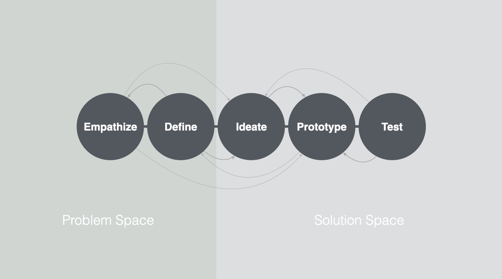

## **01 _#_** User Experience Design

### Einführung
<video controls width="100%"> 
    <source src="https://lehre.gabriel-rausch.de/HFU/IFD_SoSe20/L01/01_Einfuehrung.mp4" type="video/mp4"> 
    <a href="https://lehre.gabriel-rausch.de/HFU/IFD_SoSe20/L01/01_Einfuehrung.mp4">Zum Video</a>
</video>

### Human Factors und Ergonomics
<video controls width="100%"> 
    <source src="https://lehre.gabriel-rausch.de/HFU/IFD_SoSe20/L01/02_Human_Factors_and_Ergonomics.mp4" type="video/mp4"> 
    <a href="https://lehre.gabriel-rausch.de/HFU/IFD_SoSe20/L01/02_Human_Factors_and_Ergonomics.mp4">Zum Video</a>
</video>

### Usability
<video controls width="100%"> 
    <source src="https://lehre.gabriel-rausch.de/HFU/IFD_SoSe20/L01/03_Usability.mp4" type="video/mp4"> 
    <a href="https://lehre.gabriel-rausch.de/HFU/IFD_SoSe20/L01/03_Usability.mp4">Zum Video</a>
</video>

### User Experience
<video controls width="100%"> 
    <source src="https://lehre.gabriel-rausch.de/HFU/IFD_SoSe20/L01/04_User_Experience.mp4" type="video/mp4"> 
    <a href="https://lehre.gabriel-rausch.de/HFU/IFD_SoSe20/L01/04_User_Experience.mp4">Zum Video</a>
</video>

### Design Thinking
<video controls width="100%"> 
    <source src="https://lehre.gabriel-rausch.de/HFU/IFD_SoSe20/L01/05_Design_Thinking.mp4" type="video/mp4"> 
    <a href="https://lehre.gabriel-rausch.de/HFU/IFD_SoSe20/L01/05_Design_Thinking.mp4">Zum Video</a>
</video>

### Literature

Shneiderman, Ben, and Catherine Plaisant. Designing the user interface : strategies for effective human-computer interaction. Boston: Pearson/Addison Wesley, 2004.

Cooper, Alan, Robert Reimann, and Dave Cronin. About face 3 : the essentials of interaction design. Indianapolis, IN: Wiley Pub, 2007.

Preece, Jenny, Yvonne Rogers, and Helen Sharp. Interaction design : beyond human-computer interaction. Indianapolis, IN: Wiley, 2019.

Weyers, Benjamin, et al. The handbook of formal methods in human-computer interaction. Cham, Switzerland: Springer, 2017. Print.

Norman, Donald A. The design of everyday things. New York, New York: Basic Books, 2013.

Krug, Steve, et al. Don't make me think, revisited : a common sense approach to Web usability. San Francisco, California: New Riders, Peachpit, Pearson Education, 2014.

---

## **A _---_** Aufgabe #01
### The Wallet Project -- A try run through the full DT circle

Um die grundlegende Herangehensweise einer UX-getriebenden Produkt-Entwicklung anzuwenden werden Sie mit dem "Wallet Project" Schritt für Schritt durch den Design Thinking Prozess gehen und ein optimales Produkt für eine sehr kleine ausgewählte Zielgruppe entwickeln.

Das "Wallet Project" ist ein von der d.school vom Hasso Pattner Institute of Design at Standford vorgeschlagener "Schnellwaschgang" durch den Design Thinking Prozess, den wir hier für den Kurs adaptiert anwenden werden. Ihre Aufgabe ist es **eine ideale Geldbörse** für eine sehr kleine, ausgewählte Zielgruppe zu entwickeln (nämlich nur für eine Person). 

Bearbeiten Sie folgende Schritte

1. **Empathize**
    1. Suchen Sie sich **eine** Person, Sie stellt ihre Zielgruppe und gleichzeitig auch die repräsentative Testperson aus dieser Zielgruppe dar.
    2. Versuchen Sie eine Empathie zu der Person im Nutzungskontext mit einer Geldbörse zu schaffen. Versuchen Sie zu verstehen, wie die Person aktuell eine Geldbörse nutzt, welche Aspekte gut, welche schlecht sind. Welche Aspekte müssten Sie in Ihrer "idealen Geldbörse" berücksichtigen? Führen Sie ein "Contextual Inquiry" mit dieser Person durch. Recherchieren Sie selbst, wie diese Methode aus Interview und Beobachtung durchgeführt wird. Berücksichtigen Sie in Ihrer Planung des Contextual Inquiries die aktuellen Kontakteinschränkungen.
    3. Zur Vorbereitung Ihres Contextual Inquiries werden Sie einen Gesprächsleitfaden entwickeln. 
    4. Führen Sie Ihre qualitative Studie durch, sammeln Sie Daten (Gespräch schriftlich protokollieren, auch Zitate festhalten). Alle Daten müssen anonymisiert erhoben werden!
2. **Define**
    1. Arbeiten Sie die relevanten Aspekte aus Ihren Daten (**Top Findings**).
    2. Formuliere ein Standpunkt /Point-of-View zu den Top Findings: "Ich, als Nutzer, benötige etwas, um _ _ _ _ _ _ _, da (oder "aber...") _ _ _ _". Der Point-of-View fasst die Ziele und Wünsche, als auch Insights zusammen.
3. **Ideate**
    1. Entwickeln Sie erste Ideen. 
    2. Experimentieren Sie gerne mit Ideefindungsmethoden, wie bspw. "Crazy 8", um möglichst viele radikale Lösungsansätze zu generieren.
4. **Prototype**
    1. Entwickeln Sie eine Idee weiter.
    2. Führen Sie Ihre Idee als Skizze auf Papier weiter aus.
5. **Test**
    1. Testen Sie Ihren ersten Lösungsansatz. Präsentieren Sie Ihre Skizze und sammeln Sie erstes Feedback von Ihrem Probanden.
    2. Notieren Sie sich das Feedback, Aspekte die schon gut sind und Punkte die verbessert werden müssen.
6. **Prototype Iteration**
    1. Entwickeln Sie Ihren Prototypen weiter und berücksichtigen Sie dabei die Verbesserungsvorschläge aus dem User Testing
    2. In dieser Iteration sollte der Prototyp von der Skizze zu einem Medium Ihrer Wahl weiterentwickeln werden. Sie können dabei jedes Medium nutzen (analoge, haptische Medien bitte für die Dokumentation abfotografieren oder abfilmen).

Dokumentieren Sie Ihre Schritte gut, halten Sie die ersten Entwürfe fest und erstellen Sie eine kleine Dokumentation dieser Aufgabe in Ihrem Github Repository.

**Am 08. Mai werden wir im Online-Meeting Ihren aktuellen (fast finalen Stand) reviewen**. Bereiten Sie sich also auf eine "Elevator Pitch" (ca. 2 Minuten Präsentation) vor.

### Abgabe bis zum 10. Mai um 18:00 in Ihrer Github Repository Readme verlinken.

---

## **?! _<small>Q&A</small>_** Fragen und Antworten
(die Publikation der Zusammenfassung erfolgt nach dem Q&A Termin)

### Erste Frage?
Lorem labore cillum mollit pariatur reprehenderit dolor laboris reprehenderit dolor sit officia ea non. Lorem reprehenderit exercitation labore eiusmod aute do nostrud officia aute proident sunt. Labore non tempor aliqua voluptate. Exercitation culpa officia ut aliqua nostrud laborum irure est. Minim eu sunt culpa adipisicing laborum consectetur aliqua quis.

### Zweite Frage?
Mollit aliquip veniam sit eiusmod tempor anim ipsum tempor. Aliqua sunt voluptate ea dolor. Nulla est mollit consectetur cupidatat ut cillum ipsum minim. Est ex et nulla laborum fugiat dolore. Aliquip laboris sint exercitation commodo dolor sint mollit qui sunt ipsum fugiat occaecat id enim.