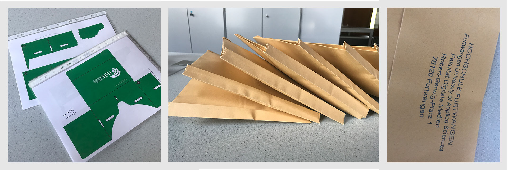

## **06 _#_** Microinteractions

### Microinteractions - Einführung

### A Brief History of Microinteractions
<video controls width="100%" poster="https://lehre.gabriel-rausch.de/HFU/IFD_SoSe20/L06/L06_02_History_of_Microinteractions.png"> 
    <source src="https://lehre.gabriel-rausch.de/HFU/IFD_SoSe20/L06/L06_02_History_of_Microinteractions.mp4" type="video/mp4"> 
    <a href="https://lehre.gabriel-rausch.de/HFU/IFD_SoSe20/L06/L06_02_History_of_Microinteractions.mp4">Zum Video</a>
</video>

### The Process of Microinteractions
<video controls width="100%" poster="https://lehre.gabriel-rausch.de/HFU/IFD_SoSe20/L06/L06_03_Process_of_Microinteractions.png"> 
    <source src="https://lehre.gabriel-rausch.de/HFU/IFD_SoSe20/L06/L06_03_Process_of_Microinteractions.mp4" type="video/mp4"> 
    <a href="https://lehre.gabriel-rausch.de/HFU/IFD_SoSe20/L06/L06_03_Process_of_Microinteractions.mp4">Zum Video</a>
</video>

### Microcopy and Tonality
<video controls width="100%" poster="https://lehre.gabriel-rausch.de/HFU/IFD_SoSe20/L06/L06_04_Microcopy_and_Tonality.png"> 
    <source src="https://lehre.gabriel-rausch.de/HFU/IFD_SoSe20/L06/L06_04_Microcopy_and_Tonality.mp4" type="video/mp4"> 
    <a href="https://lehre.gabriel-rausch.de/HFU/IFD_SoSe20/L06/L06_04_Microcopy_and_Tonality.mp4">Zum Video</a>
</video>

### Transfer Exercise
<video controls width="100%" poster="https://lehre.gabriel-rausch.de/HFU/IFD_SoSe20/L06/L06_05_Exercise.png"> 
    <source src="https://lehre.gabriel-rausch.de/HFU/IFD_SoSe20/L06/L06_05_Exercise.mp4" type="video/mp4"> 
    <a href="https://lehre.gabriel-rausch.de/HFU/IFD_SoSe20/L06/L06_05_Exercise.mp4">Zum Video</a>
</video>

### Literature

Saffer, Dan. **Microinteractions: Designing with Details**. Sebastopol, CA: O'Reilly, 2013.

---

## **A _---_** Aufgabe #06
### VR Cardboard Brille

Als Einstieg in das Prototyping von Mixed Reality User Interfaces werden wir uns zunächst eine einfache VR-Brille bauen, die wir in den Folgeaufgaben für die Erprobung unserer Konzepte nutzen können. Auch wenn Sie zu Hause unter Umständen schon eine VR-Brille besitzen, denke ich, dass diese Aufgabe den Aufbau eines Virtual-Reality-Headset wirklich _begreifbar_ macht.
Der Bausatz basiert auf [Googles Cardboard](https://developers.google.com/cardboard/) und kann mit einfache Materialien, wie Papier / Pappe, Linsen und Smartphone, entwickelt werden.

Ein Bastelpaket sollte bei Ihnen in den letzten Tagen per Post angekommen sein. Darin befindet sich eine Papiervorlage (basierend auf der Version 1 des Carboards) und ein Paar doppelkonvexe Linsen.

Folgende Punkte bitte ich Sie für diese Aufgabe zu bearbeiten:

1. Erstellen Sie ein eigenes HFU-Design für die Papiervorlage. Ein erster Impuls für eine HFU-eigene VR-Cardboard-Brille bietet die Papiervorlage aus dem Bastelpaket. Eine Vektorvorlage zur Ausgestaltung finden Sie bspw. [hier](https://manualdomundo.uol.com.br/wp-content/uploads/Scissor-cut_template.pdf). Ich würde Ihnen empfehlen, dass Sie die Brille noch etwas einfache, als in der Vorlage halten, d.h. aus meiner Sicht kann man auf den Magnet, den RFID usw. für einen schnellen Entwurf verzichten.

2. Bauen sie die Papierbrille zusammen. Die Informationen auf der [Google Cardboard Website](https://arvr.google.com/intl/de_de/cardboard/manufacturers/) sind leider zu low-level, Sie finden aber viele Videoanleitungen auf den einschlägigen Portalen. 

3. **Dokumentieren* Sie dabei den Zusammenbau mit Ihrer Foto-Kamera Schritt für Schritt.

3. Testen Sie Ihre Brille mit dem ersten Kapitel dieser Lektion.

### Die Dokumentation dieser Aufgabe bis zum 14. Juni um 18:00 in Ihrem Repo verlinken.

---

## **?! _<small>Q&A</small>_** Fragen und Antworten
(die Publikation der Zusammenfassung erfolgt nach dem Q&A Termin)